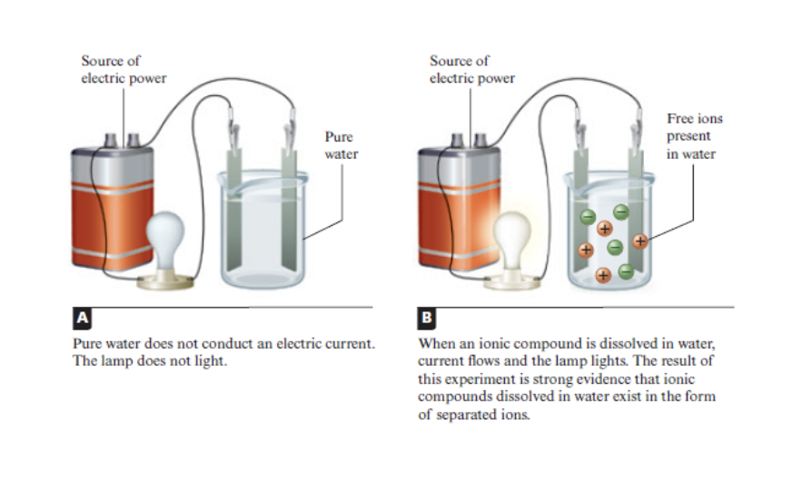
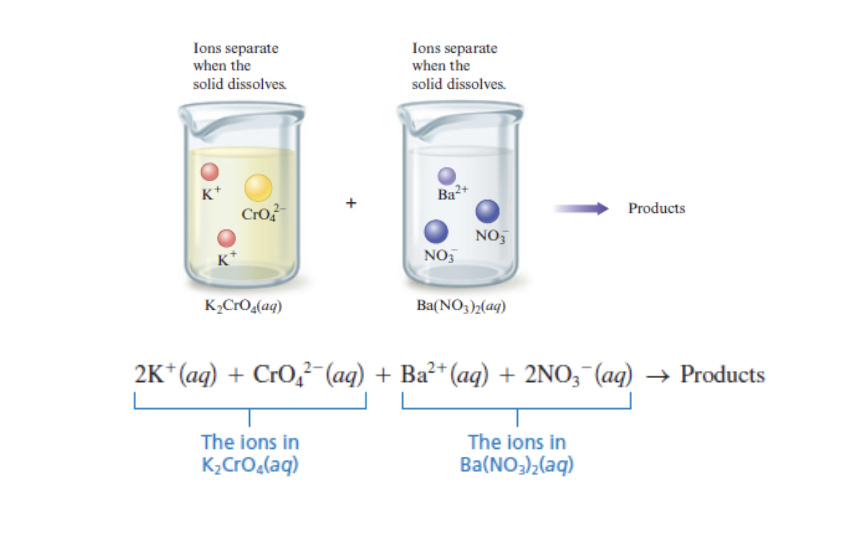
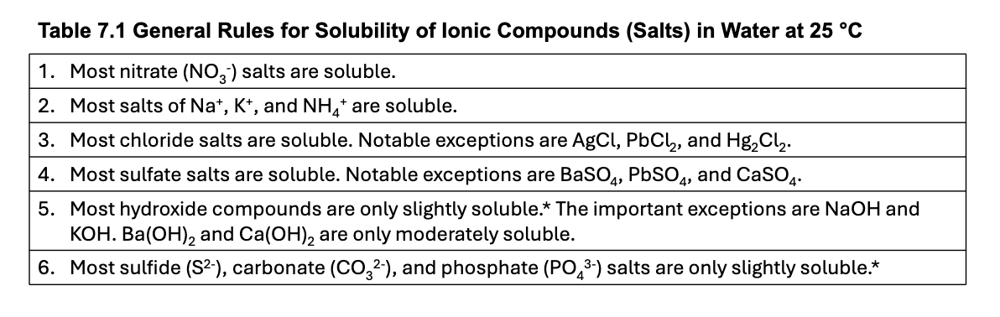

# Lecture 10-2-2026

# Chapter 7 - Reactions in Aqueous Solutions

## Determining When A Reaction Will Occur

Most Common “driving forces” of a chemical reaction are:

1.  The Formation of a solid
2.  Formation of Water
3.  Transfer of Electrons
4.  Formation of gas

## Precipitation Reactions

- One driving force for a chemical reaction is the formation of a solid, the process called precipitation.

- The solid that forms is called a precipitate, and the reaction is known as a precipitation reaction.

E.g. removing lead from drinking water.

## Ionic Compounds in Water

- In virtually every case when a solid containing ions dissolves in water, the ions separate and move independently.

  - E.g. \\\mathrm{Ba(NO_3)\_2} \mathit{(aq)}\\ doesn’t contain \\\mathrm{Ba(NO_3)\_2}\\ units, instead it contains seperate \\\mathrm{Ba^{2+}}\\ and \\\mathrm{NO_3^-}\\ ions.

## Strong Electrolytes

- Chemists know that sperated ions are present when a solution is an excellent conductor of electricty.

- Pure water does not conduct an electric current.

- Ions must be present in the water for a current to flow.

- When each unit of a substance that dissolves in water produces seperated ions, the substance is called a strong electrolyte.

Example of Electrolysis

Mixing Electrolytes Example

------------------------------------------------------------------------

## Determining What Products Form

- A solid compound must have a zero net charge.
- Most Ionic materials contain only two types of ions, one type of cation and one type of anion.

## Solubility Rules

List of Solubulity Rules

Slightly soluble and insoluble mean practically the same thing.

### Solubility Examples

\\\mathrm{NaOH}\\: Sodium Hydroxide is soluble. Meaning it will disolve in water.

\\\mathrm{BaSO_4}\\ Does not have a rule so it is therefore insoluble. If paired

\\\mathrm{CaCO_3}\\

To identify look at the two ions in the compound. Figure out if they dissolve, if they do it’s soluble, if not it’s insoluble. If they are

The last two exmaples would be visible at the bottom of the solution whereas Sodium Hydroxide would not be visible in the solution.
