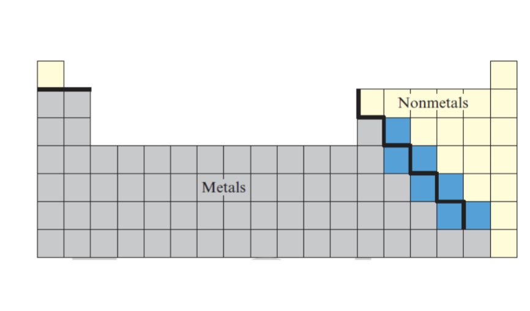
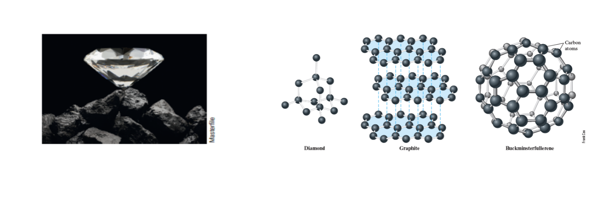
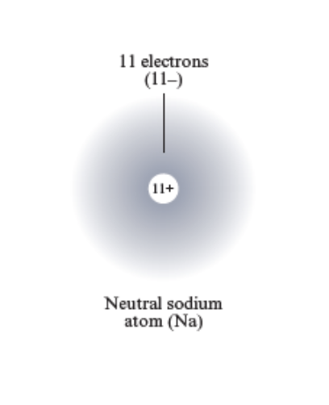
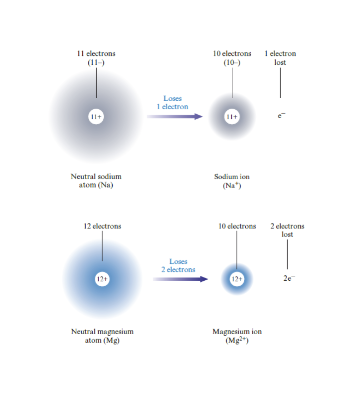
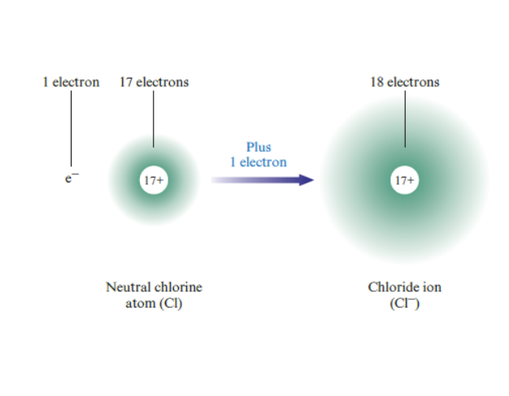
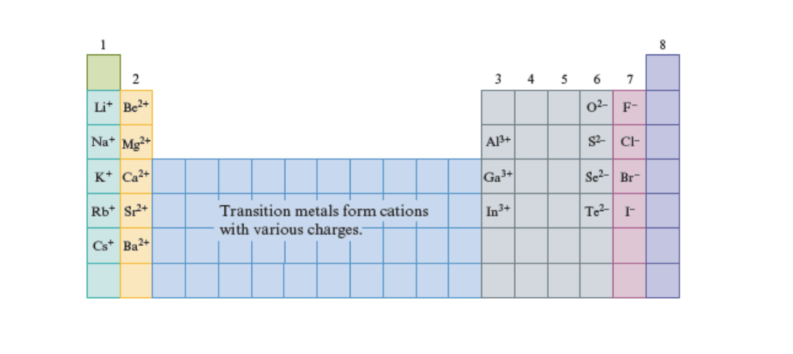
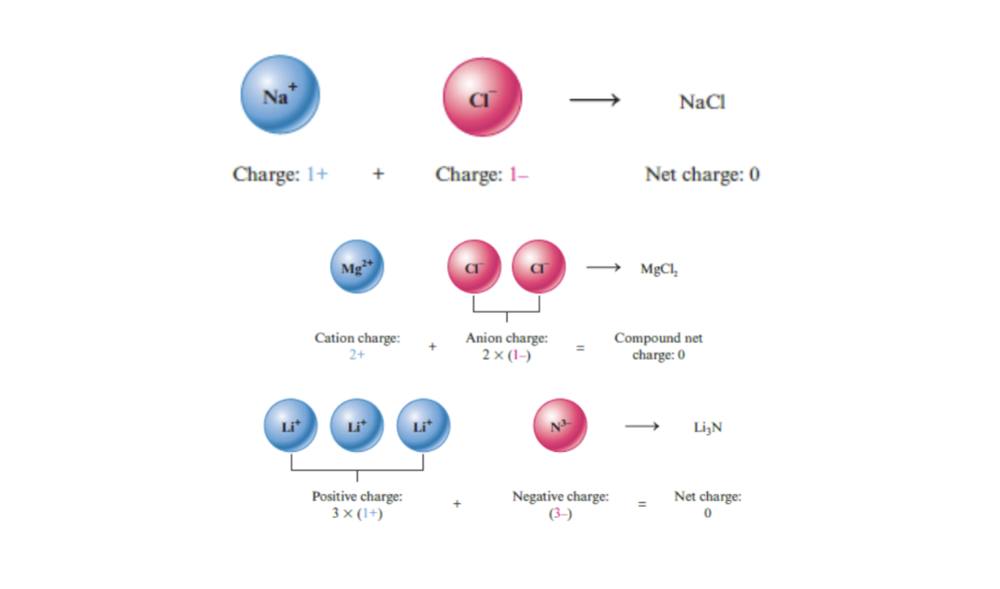

# Lecture 9-14-2026

# Chapter 4 Cont.

## Properties of Metals

- Efficient Conduction of heat and electricity
- Malleiability: Can be hammered into thin sheets
- Ductility: Can be pulled into wires
- Lustrous appeareance (shiny)

## Non-metals and Metalloids

Non-Metals and Metalloids on the Periodic Table

## Diatomic Elements

Some elements for diatomic molecules – or molecules made of two atoms. These only occur in non-metals.

## Allotropes

Allotropes are different forms of a given element. Allotropes of Carbon include diamond, graphite, and buckminsterfullerene.

Picture demonstrating the different structures of Carbon

An element in it’s natural state that has more than one chemical formula.

Allotropes are found in non-metals and metalloids.

## Ions

Neutral atoms have zero net charge, the protons and electrons are balanced to create a chareg of 0. Ions are atoms that do not have a balance of electrons and protons and therefore give off a charge.

Example of Ion

Usually electrons are removed or added with a chemical reaction of some sort.

### Cations

Cations are Ions that have a positive charge

Example of Cations

These form when an atom loses one or more electrons.

Cations retain the same name as the parent atom. Ergo \\\mathrm{Na}\\ and \\\mathrm{Na}^+\\ are both still called Sodium

From the group on the periodic table you can determine how much an atom is willing to gain or lose electron and how many.

### Anion

An Anion is an Ion with a negative charge.

Example of Anion

An Anion is formed when the given element gains electrons creating a numeric imbalance between the number of protons and the number of electrons where electrons are greater in value.

The name of an anion does change it gains *-ide* to the end of it.

Ergo Chlorine \\\mathrm{Cl}\\ in it’s anion form: \\\mathrm{Cl}^-\\ forms **chloride**.

Ion charges and the Periodic Table

Noble Gases do not form anions or cations. Noble gases form group 8 (far right of the periodic table).

Iron ionizes and loses two electrons to form the cation of Iron \\\mathrm{Fe}^{2+}\\

## Ions in Compounds

- Sodium Chloride \\\mathrm{NaCl}\\ contains \\\mathrm{Na}^+\\ ions and \\{Cl}^-\\ ions packed together.

Because the positive and negative charges attrack eachother very strongly \\\mathrm{NaCl}\\ must be heated to a very high temperature (\\800^\circ C\\) before it melts.

## Ionic Compounds

- Ionic compounds contain cations and anions, they must have a net charge of 0.

If a compound contains ions then:

1.  Both positive ions (cations) and negative ions (anions) must be present.

2.  The numbers of cations and anions must be such that the net charge is zero.

Examples of Ionic Compounds
