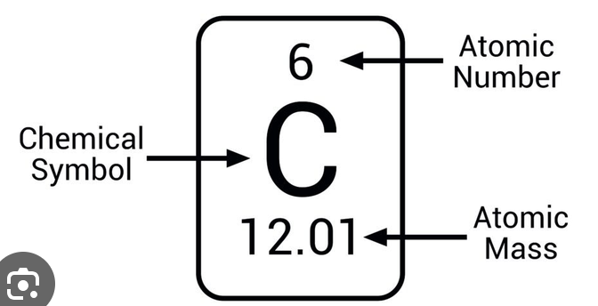
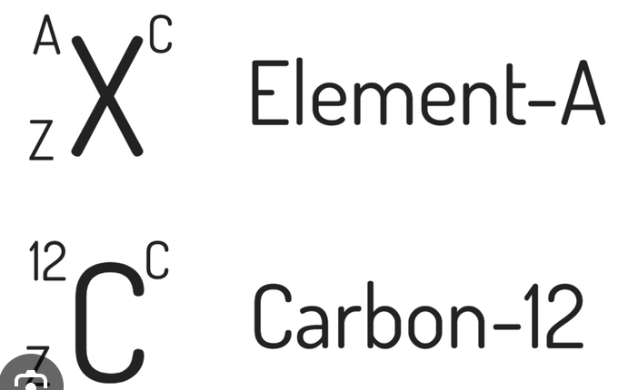
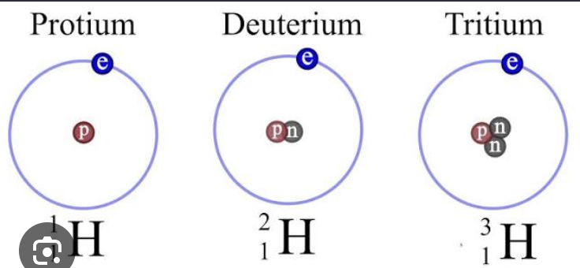

# Lecure 9-9-2026

> **NOTE:**
>
> This material is going to be on exam 2, Chapter 1’s through 3 will be exam 1 which is next Tuesday.

# Chapter 4

## Elements

- All matter can be broken down chemically into about 100 different elements.
- Compounds are made by combining atoms of the various elements
- 9 elements account form most of the compounds found in the earth’s crust.

## Elements in the Human Body

- Oxygen, carbon, hyrdrogen, and nitrogen form the basis of all biologically important molecules.
- Some elements found in trace amounts (called trace elements) are crucial for life even though they are present in small amounts.

## Symbols for Elements

- Chemists have a set of abbreviations or element symbols for the chemical elements:

For example Hydrogen is represented by the symbol \\\mathrm{H}\\

- Some names came from weird stuff so like iron came from some ferron or something like that so it has the symbol \\\mathrm{Fe}\\

## Natural Materials

1.  Most natural materials are mixtures of pure subsstances
2.  Pure substances are either elements or combinations of elements called compounds.
3.  A given compound always contains the same proportions (by mass) of the elements. For example water always contains 8 g of oxygen for every 1 g of hydrogen. Or carbon dioxide always contains 2.7g of oxygen for every 1 g of carbon.

This principle is known as the **law of constant composition**.

## Dalton’s Atomic Theory

This is the classical atomic theory and differs slightly from modern atomic theory.

1.  Elements are made up of tiny particles called atoms.
2.  All atoms of a given element are identical.
3.  The atoms of a given element are different from those of any other elements.
4.  Atoms of one element can combine with atoms of other elements to form compounds. A given compound alwasy has the same relative numbers and types of atoms.
5.  Atoms are individisible in chemical processes, that is atoms are neither created nor destroyed in a chemical reaction. A chemical reaction simply changes the way the atoms are grouped together.

Atomic Number

The Atomic Number of an element refers to the number of protons in it’s nucleus.

## Formulas of Compounds

- A compound is a distinct substance composed of the atoms of two or more elements and always contains the same relative masses of those elements.
- The types of atoms and the number of each type in each unit (molecule) of a given compound are conveniently expressed by a chemical formula.

### Rules for Writing Formulas

1.  Each atom present is represented by its element symbol
2.  The number of each type of atom is indicated by a subscript on the element symbol.
3.  When only one atom of a given type is present no subscript is needed.

E.g.

\\ \mathrm{NO} \\

a chemical formula with one Nitrogen atom and one Oxygen atom.

Or For water:

\\ \mathrm{H_2O} \\

Indicates two hydrogen atoms and one oxygen atom.

### Rutherford’s Gold Foil Experiment

Is what we derived the nucleus from. Basically stuff bounced backwards which suggests that the center of an atom is larger than a smaller particle.

## The Nuclear Model

- The \\\alpha{}\\ particles passed directly throught the foil because the atom is mostly empty space.
- The deflected particles came into contact with the center of the atom (the nucleus)

## Protons and Neutrons

- A proton has the same size as a neutron and the proton has a positive charge equal to the magnitude of the electrons negative charge.

## Isotopes

- Isotopes are atoms with the same number of protons but differin numbers of electrons.
- The number of protons in a nucleus is called the atom’s atom number.

### Isotope Notation

1.  The number of protons in a nucleus is called the atom’s atomic number
2.  THe sum of the number of neutrons and the number of protons in a nucleus is called the atom’s mass number.

Where, 1. is A and 2. is B

\\ A + Z = \space \text{The Atomic Mass Number} \\

Isotope Notation

\\ \newline \newline \newline \\

Additional Isotope Notation Example

## The Periodic Table

1.  Groups have elements with similar chemical properties, columns represent the groups of the periodic table.
2.  Periods are the rows of elements

### Groups

A family of elements with similar chemical properties that lie in the same vertical column on the periodic table.
