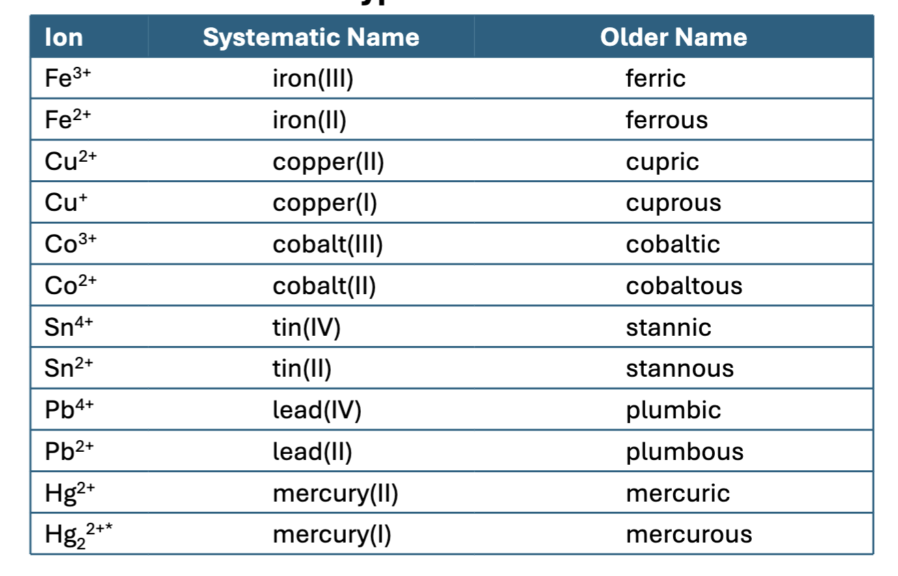

# Chapter 5 - Nomenclature

## Binary Compounds

- Binary compounds are compounds composed of two elements

- You can divide binary compounds into two broad classes

  - Compounds that contain a metal and a nonmetal

  - Compounds that contain two nonmetal

### Binary Ionic Compounds

When a metal combines with a non-metal the resulting compound contains ions.

The metal will lose an electron and form a cation. The nonmetal gains the electron and becomes an anion.

The naming convention is anion first then cation.

### Type I Compounds

- Certain metal atoms only from one cation.

  - For example, $\mathrm{Na}$ only form $\mathrm{Na}^+$, likewise $\mathrm{Cs}$ only forms $\mathrm{Cs}2+$

Naming Type I Compounds:

1.  $\mathrm{KCl}$
    1.  This is a type I compound

### Type II Compounds

These metal atoms can form two or more cations, these are also Type II Binary Compounds. These are typically transition metals.

### Rules for Naming Type I Ionic Compounds

Name the Cation first and then the Anion. A simple cation takes its name from the name of the element.

A simple Anion is named by taking the first part of the element name (the root) and adding "-ide" to the end.

Therefore $\mathrm{Cl}^-$ is Chloride.

1.  Compounds formed from metals and nonmetals are ionic.
2.  In an ionic compound the cation is always named first.
3.  The net charge on the ionic compound is always zero.

Ex: $\mathrm{LiBr}$ is Lithium bromide

$\mathrm{SrCl_2}$ is Strontium chloride

$\mathrm{Rb_2Se}$ Rubidium selenide

$\mathrm{CaO}$ Calcium oxide

$\mathrm{AlF_3}$ is Aluminum fluoride

### Rules for Naming Type II Ionic Compounds

Many metal atoms can form two or more cations. We use the Roman numeral to specify the charge on the cation. When dealing with transition metals in an ionic compound use the naming convention for example $\mathrm{Fe}^{3+}$ just say iron(III). The roman numeral specifies the charge on the element in the ion.

1.  The cation is always named first and the anion second.
2.  Because the cation can assume more than one charge, the charge is specified by a Roman numeral in parenthesis.

This is easy as ionic compounds are balanced (with regards to charge) so we can derive the charge on the transition metal.

Ex: $\mathrm{CuF}$ would have $\mathrm{Cu}^+$ and $\mathrm{F}^-$. So we know we have copper(I) fluoride. Whereas with $\mathrm{CuF_2}$ gives us $\mathrm{Cu}^{2+}$ therefore, we have copper(II) fluoride.