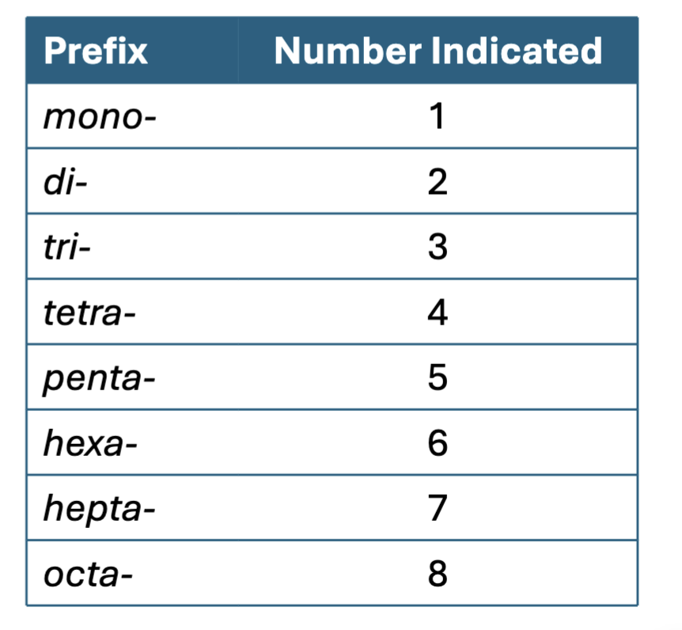
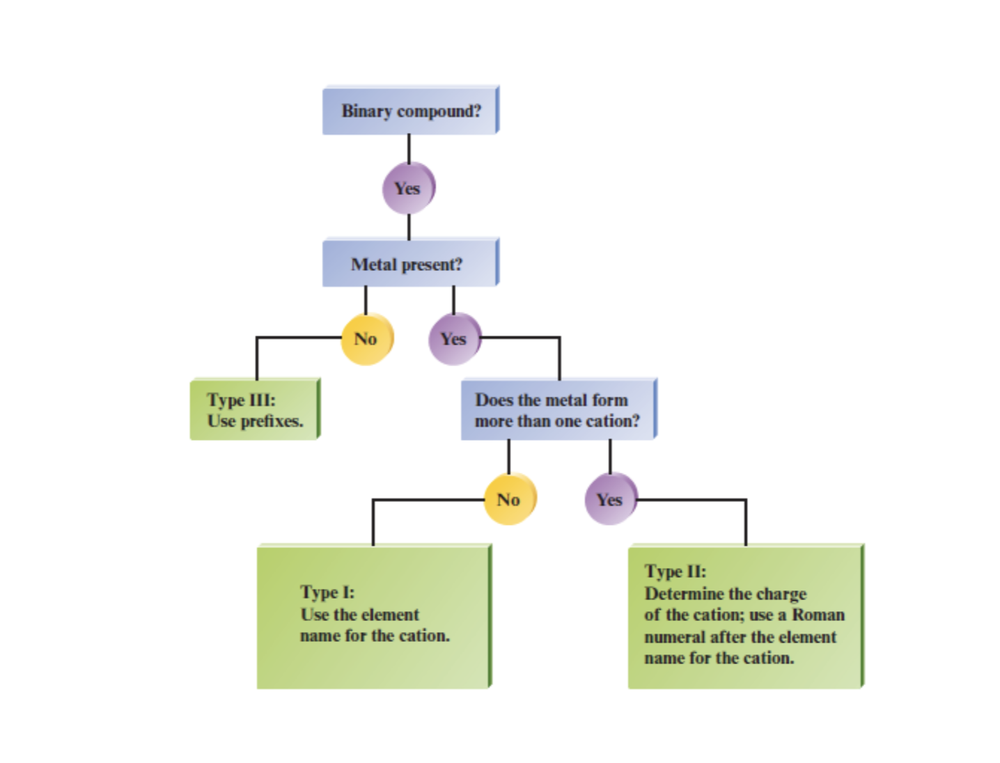
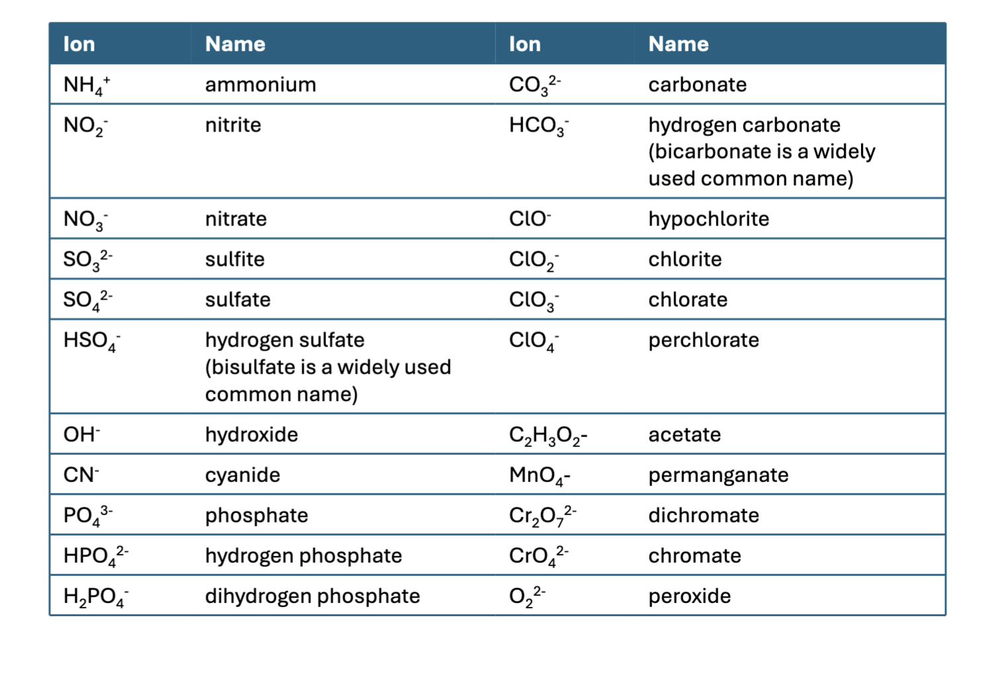

# Chapter 5 Cont.

## Type III Binary Compounds

These inlcude two non-metal ions. Nonmetals combine in various ratios. Prefixes are used to indicate the number of each type of nonmetal atom.

The ability of these ions to form compounds comes from electron sharing not a change in charge.

There is a prefix on the first element if there is more than one of it, the second element ALWAYS gets a prefix even with just one.

The ending of the second element still has it's ending changed to "-ide" but the first element keeps the same name.

#### Rules for Naming Type III Compounds

1.  The first element used in the formula is named first and the full element name is used.
2.  The second element is named as though it were an anion.
3.  Prefixes are used to denote the numbers of atoms present.
4.  The prefix mono-is used on the second element if there is only one.

ex: $\mathrm{N_2O_4}$ dinitrogen tetraoxide.

$\mathrm{SF_6}$: sulfur hexafluoride.

$\mathrm{NCl_3}$ Nitrogen trichloride

$\mathrm{PF_5}$ phosphorus pentafluoride

$\mathrm{S_2O}$ disulfur monoxide

## Types of Binary Compounds

- Type I: Ionic compounds with metals that always form a cation with the same charge

- Type II: Ionic compounds with metals (usually transition metals) that form cations with various charges

- Type III Compounds that contain only nonmetals.

Ex:

$\mathrm{BaBr_2}$ : Barium bromide

$\mathrm{XeF_4}$ Xenon tetrafluoride

$\mathrm{IrO}$ Iridium(II) oxide

$\mathrm{CI_4}$ Carbon tetraiodine

$\mathrm{NO}$ Nitrogen monoxide

## Polyatomic Ions

- Polyatomic ions are charged entities composed of several atoms bounded together.

- Polyatomic ions are assigned special names that you have to memorize to name the compounds containing them.

In order to know these you just have to memorize them, it's annoying but it's how it works because.

For all of group 17:

$\mathrm{ClO_4^-}$: perchlorate

$\mathrm{ClO_3^-}$: chlorate

$\mathrm{ClO_2^-}$: chlorite

$\mathrm{OCl^-}$ : hypochlorite

The prefix "per" meaning most, and the prefix "hypo" meaning least.

Therefore:

$\mathrm{NO_3^-}$: Nitrate

$\mathrm{NO_2^-}$: Nitrite

Or:

$\mathrm{HPO_4^{2-}}$: hydrogen phosphate

$\mathrm{H_2PO_4^-}$: dihydrogen phosphate

Know the Chlorine, Bromine, Iodine polyatomic ions, they just come up with the same O and prefixes and suffixes as expected:

So: $\mathrm{IO_3^-}$: Iodate, so on and so forth.

### Naming Polyatomic Ions

- Naming Ionic compounds that contain polyatomic ions is very similar to naming binary ionic compounds:

  - E.g. the compound $\mathrm{NaOH}$ is called sodium hydroxide because it contains the $\mathrm{Na^+}$ cation and the $\mathrm{OH^-}$ hydroxide anion.

- Remember that when a metal is present that forms more than one cation, a Roman numeral is required to specify the cation charge, just as in naming Type II binary ionic compounds.

  - $\mathrm{FeSO_4}$ is called Iron (III) sulfate in order to keep the charges balanced.

  - $\mathrm{NH_4Cl}$ ammonium chloride

$\mathrm{KOH}$: potassium hydroxide

$\mathrm{TiCO_3}$ Titanium (II) carbonate

$\mathrm{NaCN}$ Sodium cyanide