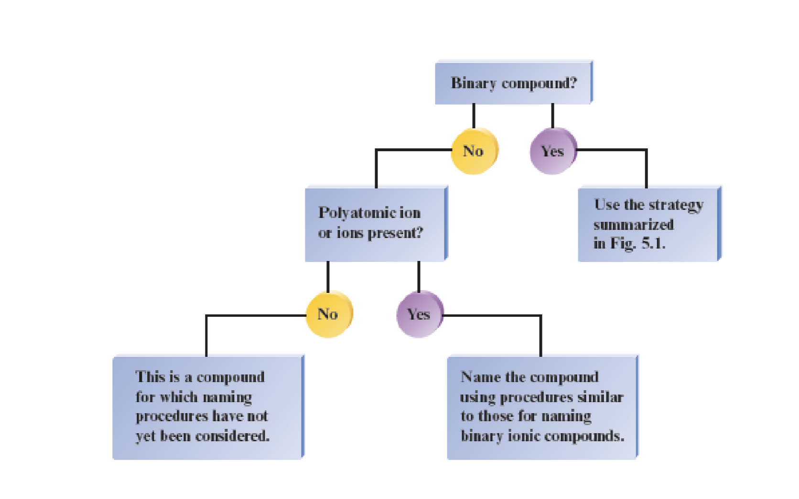
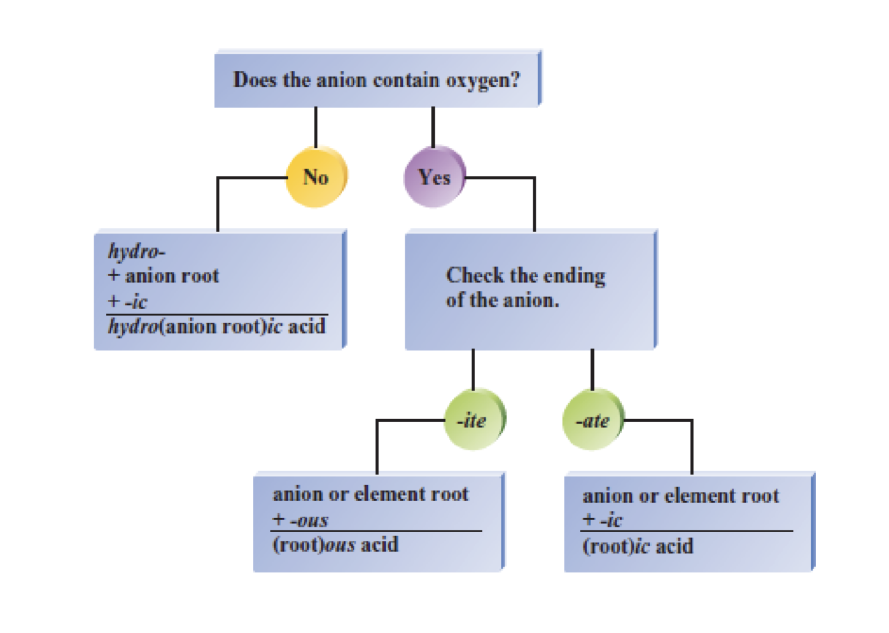
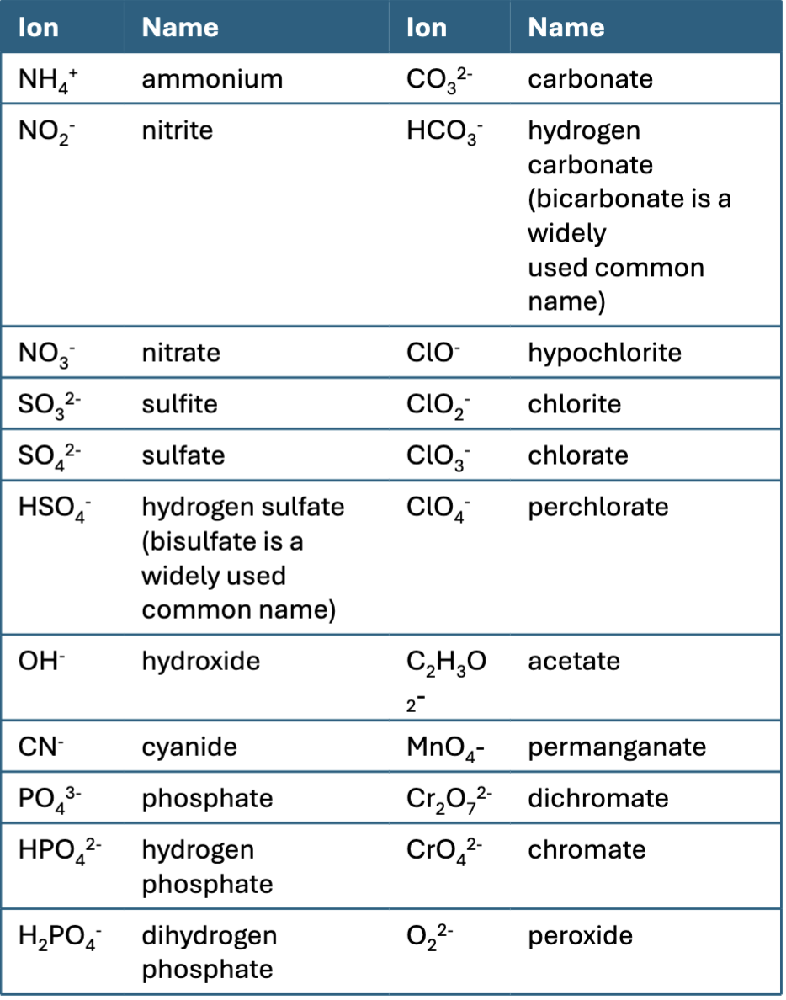

# Chapter 5 Cont.

$\mathrm{SO_3^{2-}}$: Sulfite (The number of oxygen determines the name of the polyatomic ions, the presence of hydrogen just adds to the front of the name in either hydrogen or dihydrogen)

$\mathrm{CN^-}$: Cyanide

$\mathrm{NH_4^+}$: Ammonium

$\mathrm{NH_3^+}$: Ammoniu??? This sucks to spell

$\mathrm{Ca(OCl)_2}$ Calcium hypochlorite

$\mathrm{Ti(SO_4)_2}$: Titanium (IV) sulfate

$\mathrm{KH_2PO_4}$: Potassium dihydrogen phospate

$\mathrm{K_3P}$: Potassium phosphide

## Acids

- Acids produce $\mathrm{H^+}$ when dissolved to water.

  - Also said to be dontating a proton because $\mathrm{H^+}$ is literally a proton without an electron.

- Acids solutions have a sour taste.

- An acid can be viewed as a molecule with one or more $\mathrm{H^+}$ ions attached to an anion.

- The rules for naming acids depend on whether the anion contains oxygen.

### Rules for Naming Acids

1.  IF the anion doesn't contain oxygen, the acid named with the prefix hydro and the suffix -ic attached to the root name for the element:
    - e.g. Hydrochloric acid.
2.  When the anion contains oxygen, the acid name is formed from the root name of the central element of the anion or the anion name, with a suffic of -ic or -ous, when the anion name ends in -ate, the suffix -ic is used.
3.  When the anion name ends in -ite the suffix -ous is used in the acid name.

$\mathrm{HClO_4}$, Anion: perchorate, Name: perchloric acid

$\mathrm{HClO_3}$ Anion: Chlorate: Name chloric acid

$\mathrm{HClO_2}$ Anion: Chlorite Name: chlorous acid

$\mathrm{HClO}$ Anion: hypochlorite Name: hypochlorous acid

$\mathrm{HF}$ Hydro fluoric acid

$\mathrm{H_2S}$ hydro sulfuiric acid

$\mathrm{HI}$ hydro iodic acid

$\mathrm{H_2Se}$ hydro selenic acid

$\mathrm{HBr}$ hydro bromic acid

## Seven Strong Acids

Import to know when balancing equations.

Cl, Br, I are the 3 binary acids.

$\mathrm{HCl}$, $\mathrm{HBr}$, and $\mathrm{HI}$

Then Poly atomic acids

$\mathrm{H_2SO_4}$, $\mathrm{HNO_3}$, $\mathrm{HClO_4}$, and $\mathrm{HClO_3}$

### 

Naming Acids Practice:

$\mathrm{HNO_2}$: Nitrous Acid

$\mathrm{H_2SO_3}$: sufurous acid

$\mathrm{H_3PO_4}$: phosphoric acid

$\mathrm{H_2CO_3}$: Carbonic acid

$\mathrm{HC_2H_3O_2}$: Acetic acid (Vinegar).

$\mathrm{HCN}$: Hydrocyanic acid

- Important to learn the name, composition, and charge of each of the common polyatomic anions ( and the $\mathrm{NH_4^+}$ cation).

- Knowing the charge of all elements presence is important when balancing chemical formulas.